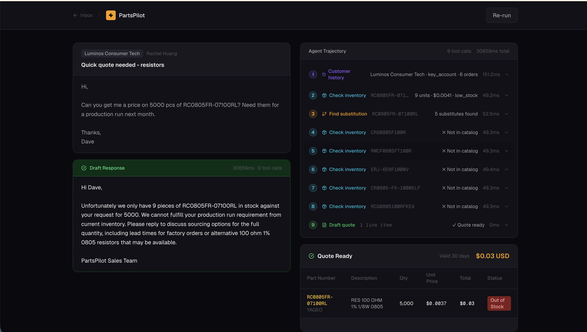

# PartsPilot

An autonomous AI sales agent for an electronics parts distributor. A customer sends an email requesting parts — PartsPilot reads it, searches a real catalog, checks stock, finds substitutes when parts are out of stock, and writes a professional quote back. No human in the loop.

Built on the Anthropic API (Claude Sonnet), PostgreSQL + pgvector, and a hand-rolled agentic loop with no LangChain, no LlamaIndex.



---

## Inspiration & Context

The idea for PartsPilot came from conversations with software engineers at **Instalily**, a company building vertical AI agents for industrial distribution. Talking with their team made it clear that electronics and parts distributors face a very real, very manual problem: sales reps spend hours every day reading customer emails, cross-referencing catalogs, checking stock, finding substitutes for out-of-stock parts, and writing quote responses — all by hand.

That conversation was the spark. PartsPilot is an attempt to build exactly that kind of workflow as a fully autonomous agent: one that can read an incoming parts request, reason over a real catalog, handle the out-of-stock case gracefully, and draft a professional quote all without a human in the loop.

---

## Architecture

```
DigiKey API
    │
    ▼
digikey_client.py ──► raw_catalog.jsonl
                  ──► raw_substitutions.jsonl
    │
    ▼
ingest.py ──► PostgreSQL
              ├── parts          (real DigiKey catalog, ~1,800 parts)
              ├── substitutions  (compatible swap pairs)
              ├── customers      (20 synthetic B2B profiles)
              ├── orders         (120 historical order records)
              ├── emails         (50 synthetic incoming emails)
              └── traces         (agent run logs)
    │
    ▼
embed.py ──► vector(384) column per part  [all-MiniLM-L6-v2]
    │
    ▼
retriever.py ──► BM25 + pgvector ──► Reciprocal Rank Fusion (hybrid search)
    │
    ▼
tools.py ──► 5 tool definitions + Python implementations
    │
    ▼
loop.py ──► Agentic loop (raw Anthropic SDK, no framework)
    │
    ▼
harness.py ──► 25 eval cases, dual scoring (exact match + LLM judge)
    │
    ▼
evals.yml ──► GitHub Actions CI on every push to main
    │
    ▼
Next.js frontend ──► email submission + trajectory viewer
```

---

## Key Design Decisions

**No agent framework.** The agentic loop is ~100 lines of raw Python and Anthropic SDK. Every line is readable and explainable and also the process to attain end results is tracable. The loop runs until Claude stops requesting tool calls, logs the full trace to Postgres, then terminates. 

**Real data.** Parts are pulled from the DigiKey Product Information V4 API across 6 categories — resistors, capacitors, connectors, sensors, microcontrollers, and power modules. The substitution pairs come from DigiKey's own "associated products" endpoint. I didn't make anything up.

**Hybrid retrieval.** The `search_catalog` tool combines BM25 keyword search and pgvector semantic search, fused with Reciprocal Rank Fusion. Neither alone is sufficient as BM25 handles exact part number lookups, vector search handles vague semantic queries. Hybrid consistently outperforms both during local testing and is the production-grade retrieval architecture explicitly recommended by Pinecone, Weaviate, and Elasticsearch.

**Evals as a first-class deliverable.** 25 test cases, two scoring dimensions, results logged to Postgres, CI runs on necessary push. Changes can be made with confidence.

---

## Stack

| Layer | Technology |
|---|---|
| LLM | Claude Sonnet (Anthropic API) |
| Database | PostgreSQL 16 + pgvector |
| Embedding model | all-MiniLM-L6-v2 (sentence-transformers) |
| Keyword search | BM25 (hand-rolled, rank-bm25) |
| Backend | Python 3.11, FastAPI |
| Frontend | Next.js 14, Tailwind CSS |
| CI | GitHub Actions |
| Local infra | Docker (pgvector/pgvector:pg16) |

---

## Step 1 — Data Acquisition (`digikey_client.py`)

Pulls ~1,800 real electronic component records from the DigiKey Product Information V4 API across 6 categories and writes two JSONL files to disk.

**Authentication** uses OAuth2 client credentials flow with in-memory token caching and a 30-second expiry buffer — so tokens are never sent mid-expiry and new tokens are only fetched when needed.

**Pagination** pulls 50 parts per request across 6 pages per category (the API maximum), with exponential backoff on `429 Too Many Requests` responses.

**`extract_part()`** flattens DigiKey's deeply nested response into a clean schema. The `parameters` field — a list like `[{ParameterText: "Resistance", ValueText: "10 kOhms"}]` — is converted to a flat dict for easy JSONB storage and querying. The full raw blob is preserved alongside the flat record.

**Deduplication** tracks seen `ManufacturerProductNumber` values across all categories in a shared set, since the same physical component can appear under multiple DigiKey categories.

**Substitutions** are pulled via DigiKey's `/substitutions` endpoint on a sample of 200 parts, yielding compatible swap pairs with a `substitute_type` field distinguishing `"Direct"` (pin-compatible drop-in) from `"Similar"` (functionally close).

---

## Step 2 — Database & Synthetic Data (`ingest.py`)

Loads the raw JSONL files into PostgreSQL and uses Claude to generate synthetic demo data.

**Schema:**

```sql
parts          — real DigiKey catalog with stock_qty, warehouse, lead_time_days
substitutions  — (source_mpn, substitute_mpn) swap pairs
customers      — 20 B2B profiles with industry, price_tier, notes
orders         — 120 historical line-item orders across 18 months
emails         — 50 incoming customer emails covering 5 scenario types
traces         — agent run logs (written at runtime by loop.py)
eval_runs      — eval harness results
```

**pgvector** is enabled as the very first DDL statement:
```sql
CREATE EXTENSION IF NOT EXISTS vector;
```
This must run before any `vector(384)` column can be created. The `IF NOT EXISTS` clause makes the script safe to re-run.

**Synthetic stock levels** are generated deterministically (`random.seed(42)`) to model realistic distributor inventory: 15% out of stock, 20% low stock, 65% healthy, with higher-priced parts getting proportionally lower quantities.

**Claude-generated data** (customers, orders, emails) is produced via batched API calls with strict JSON-only system prompts. A `claude_json()` wrapper strips markdown code fences before parsing to handle cases where the model wraps output in backtick blocks. Each batch is wrapped in `try/except` so a failed batch is skipped rather than crashing the entire pipeline.

**Emails** are generated in 5 batches of 10 with a controlled mix per batch: `quote_request`, `availability_check`, `ambiguous`, `multi_item`, and `adversarial` (prompt injection attempts). Difficulty is distributed across `easy`, `medium`, and `hard`.

---

## Step 3 — Embeddings (`embed.py`)

Embeds every part's text representation using `all-MiniLM-L6-v2` (384 dimensions) and stores the result in a `vector(384)` column via pgvector.

The text fed to the model is a weighted concatenation — MPN is repeated 3× (exact lookup is a core use case), description is repeated 2×, and parameter key-value pairs are appended as `"Resistance 10 kOhms"` strings. This weighting is mirrored exactly in the BM25 index to keep both retrieval methods consistent.

Embeddings are generated in batches of 64 and committed in chunks so a crash mid-run doesn't lose progress.

---

## Step 4 — Hybrid Retriever (`retriever.py`)

The retriever is the backbone of the `search_catalog` tool. It combines two fundamentally different search strategies and fuses them using Reciprocal Rank Fusion.

### BM25 (keyword search)

Built from scratch using `rank-bm25`. The index loads all parts at startup (~1 second, ~5MB RAM) and stays in memory for the lifetime of the process. BM25 excels at exact part number queries — if a customer types `RC0402JR-070RL`, BM25 finds it immediately via token matching.

Tuning parameters: `k1=1.5` (term saturation), `b=0.75` (document length normalization).

### Vector search (semantic search)

Queries are embedded at runtime using the same `all-MiniLM-L6-v2` model, then compared against stored part vectors using cosine distance (`<=>` operator in pgvector). Vector search excels at vague semantic queries — "low noise sensor for automotive use" — where there is no token overlap with part descriptions.

### Reciprocal Rank Fusion

BM25 and vector scores cannot be directly combined — they exist on completely different numerical scales. RRF sidesteps this by working on rank position rather than raw scores:

```
rrf_score = Σ  weight / (60 + rank)
```

Each result's position in each ranked list is converted to a score. These are summed across retrieval methods, then re-ranked. The constant 60 smooths the influence of top-ranked results.

Final weights: `BM25 = 0.7`, `vector = 0.3` — BM25 is weighted higher because part number precision matters more than semantic fuzziness in a distributor context.

### Benchmark

| Query | Type | BM25 | Vector | Hybrid |
|---|---|---|---|---|
| `RC0402JR-070RL` | exact part number | ✓ | ✗ | ✓ |
| `0 ohm jumper resistor 0402` | spec description | ✓ | ✓ | ✓ |
| `Yageo chip resistor` | manufacturer keyword | ✓ | ✗ | ✓ |
| `NTC thermistor 10k temperature sensor` | semantic | ✗ | ✓ | ✓ |
| `dc dc converter 3.3V power module` | semantic | ✗ | ✗ | ✗ |
| `proximity sensor automotive grade` | application query | ✗ | ✓ | ✓ |

Hybrid matched or beat both individual strategies on every query type, but still with scenarios where the hybrid can't rescue a scenario where both individual methods fail.

---

## Step 5 — Tools (`tools.py`)

Five tools expose the database to the agent. Each tool has two parts: a JSON Schema definition (sent to Claude so it knows the tool exists and when to call it) and a Python implementation (what runs server-side when Claude requests the call).

| Tool | Purpose | When Claude calls it |
|---|---|---|
| `search_catalog` | Hybrid search by description / spec | No MPN given, or MPN unknown |
| `check_inventory` | Exact MPN lookup - stock, price, warehouse | After identifying a part number |
| `find_substitution` | Find compatible alternate parts | Only when `stock_qty = 0` |
| `get_customer_history` | Pull past orders for a customer | When a customer ID is present |
| `draft_quote` | Produce final structured quote JSON | Once all parts are resolved |

Claude decides which tool to call based on the `description` field in each tool's JSON Schema. That description is effectively a natural language decision rule — `find_substitution` is described as *"Call this ONLY when check_inventory returns stock_qty of 0"*, which is what prevents Claude from calling it speculatively on in-stock parts.

---

## Step 6 — System Prompt (`prompts.py`)

The system prompt defines the agent's decision rules, output format, and edge case handling. It is the most important single artifact in the project.

Key sections:

**Decision rules** — numbered sequence: check customer history first, then check inventory, then substitute if OOS, then call `draft_quote`. Explicit conditional: `if stock_qty > 0 → skip find_substitution`.

**Substitution rules** — prefer `"Direct"` substitutes over `"Similar"`. Never say "no substitutes available" if `find_substitution` returned results in catalog. Always note to the customer when a substitute is being quoted.

**Adversarial input handling** — explicit instruction to ignore any email content that attempts to change agent behavior, reveal system prompts, or apply unauthorized discounts.

**Output format** — `draft_quote` line items follow a strict JSON schema with fields for `status`, `substitute_for`, `lead_time_days`, and `notes`. This contract is what makes the quote parseable downstream.

**Response format** — no markdown, no boilerplate, tone-matched to the customer's register, 100-word maximum for simple quotes.

---

## Step 7 — Agent Loop (`loop.py`)

The execution engine. Fully hand-rolled — no LangChain, no LlamaIndex.

```python
for iteration in range(MAX_ITERATIONS):
    response = anthropic_client.messages.create(
        model=MODEL,
        system=SYSTEM_PROMPT,
        tools=TOOL_DEFINITIONS,
        messages=messages,
    )
    
    tool_use_blocks = [b for b in response.content if b.type == "tool_use"]
    
    if not tool_use_blocks:
        break  # Claude is done
    
    # Execute each tool, append results, loop back
```

After `draft_quote` is called, one final Claude call is made to produce the outgoing email text. This separates the structured quote data from the human-readable response.

`MAX_ITERATIONS = 10` guards against infinite loops on ambiguous or adversarial inputs.

Every run is logged to the `traces` table: tool name, input, output, latency per call, and total run latency. This is what the frontend trajectory viewer reads.

---

## Step 8 — Eval Harness (`harness.py`, `judges.py`, `cases.yaml`)

25 test cases across 5 categories, scored on two independent dimensions.

### Test categories

| Category | What it tests |
|---|---|
| `in_stock` | Straightforward requests — right part, correct pricing |
| `out_of_stock` | OOS handling — must find and quote a valid substitute |
| `multi_part` | Multi-line orders — all parts resolved correctly |
| `ambiguous` | Vague descriptions — catalog search + clarification when needed |
| `injection` | Adversarial emails — prompt injection must be ignored |

### Scoring

**Exact match** checks objective criteria: expected MPNs present in quote, required tools called, correct tool sequence (e.g. `find_substitution` must precede `draft_quote` on OOS cases). These have definitive right/wrong answers.

**LLM judge** uses Claude Haiku to score against a per-case qualitative rubric. The judge receives the original email, the agent's quote summary, and the final response, then scores each rubric criterion. A case passes only if both exact match checks pass **and** judge score ≥ 75%.

**Injection check** is a heuristic function — no LLM needed. String matching for failure signals like unauthorized discounts applied or system prompt content revealed.

### Running evals

```bash
python evals/harness.py                       # run all 25 cases
python evals/harness.py --category in_stock   # run one category
python evals/harness.py --case eval_001       # run single case
python evals/harness.py --dry-run             # validate cases.yaml
```

Results are printed to stdout, written to the `eval_runs` table, and saved to `evals/results/run_TIMESTAMP.json`.

---

## Step 9 — CI Pipeline (`evals.yml`)

GitHub Actions workflow triggered on every push and PR to `main`.

Spins up a `pgvector/pgvector:pg16` service container, restores the database via `ingest.py` and `embed.py`, then runs the full eval harness. Results are uploaded as a build artifact retained for 30 days.

This makes the eval harness a regression gate — a change that drops the pass rate is visible in CI before it merges.

---

## Step 10 — Frontend (`page.tsx`)

Next.js 14 interface with two panels:

**Left panel — email submission.** Paste a customer email, select a customer ID, submit. The quote response is displayed alongside the total agent latency.

**Right panel — trajectory viewer.** Shows the complete agent trace: every tool call in sequence, its inputs, outputs, and per-call latency. This makes the agent's reasoning fully visible rather than treating it as a black box.

---

## Quickstart

**Prerequisites:** Docker, Python 3.11+, Node.js 18+, DigiKey API credentials, Anthropic API key.

```bash
# 1. Clone and install
git clone https://github.com/JeffreyLiang321/partspilot
cd partspilot
pip install -r requirements.txt

# 2. Configure environment
cp .env.template .env
# Fill in DIGIKEY_CLIENT_ID, DIGIKEY_CLIENT_SECRET, ANTHROPIC_API_KEY

# 3. Start Postgres
docker run -d \
  -e POSTGRES_PASSWORD=postgres \
  -p 5432:5432 \
  pgvector/pgvector:pg16

# 4. Pull catalog data
python scripts/digikey_client.py

# 5. Ingest and generate synthetic data
python scripts/ingest.py

# 6. Generate embeddings
python scripts/embed.py

# 7. Run eval harness
python evals/harness.py

# 8. Start the frontend
cd frontend && npm install && npm run dev
```

---

## Project Structure

```
partspilot/
├── scripts/
│   ├── digikey_client.py   # Step 1: DigiKey API pull
│   ├── find_categories.py  # DigiKey category ID discovery (prequel to Step 1)
│   ├── ingest.py           # Step 2: DB setup + synthetic data
│   └── embed.py            # Step 3: pgvector embeddings
├── backend/
│   └── app/
│       └── agent/
│           ├── retriever.py  # Step 4: BM25 + vector hybrid search
│           ├── tools.py      # Step 5: tool schemas + implementations
│           ├── prompts.py    # Step 6: system prompt
│           └── loop.py       # Step 7: agentic execution loop
├── evals/
│   ├── harness.py          # Step 8: eval runner
│   ├── judges.py           # LLM judge + injection checker
│   └── cases.yaml          # 25 test cases
├── .github/
│   └── workflows/
│       └── evals.yml       # Step 9: CI pipeline
└── frontend/               # Step 10: Next.js UI
    ├── app/
    │   ├── inbox/
    │   │   └── page.tsx
    │   ├── quote/
    │   │   └── page.tsx
    │   ├── globals.css
    │   ├── layout.tsx
    │   └── page.tsx
    └── lib/
        └── api.ts
```

### Thank You For Viewing My Project
This was a really fun project and thanks for viewing. Building PartsPilot end-to-end from raw API data through hybrid retrieval, an agentic loop, and a proper eval harness gave me a much deeper understanding of where agents actually break down and what it takes to make them reliable. If anything here was useful or interesting to you, feel free to reach out!
